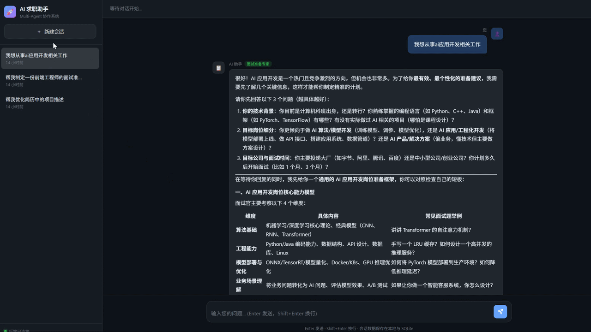

# Interview Assistant · 多 Agent 协作求职助手

<p align="center">
  
</p>

<p align="center">
  <a href="https://xuehualiange.github.io/interview-assistant/">🌐 在线体验</a> •
  <a href="#快速开始">⚡ 本地运行</a>
</p>

> **从架构设计到工程落地的完整闭环** — 先写 SKILL 设计文档，再实现可运行的 FastAPI 后端、SSE 前端与 Docker 部署。

[](https://github.com/xuehualiange/interview-assistant)


[English](#english) | [中文](#chinese)

---

## 中文

AI 驱动的求职全链路助手，采用 **Triage + Specialist Handoff** 多 Agent 架构。本项目包含两层交付：

| 层级 | 内容 | 说明 |
|------|------|------|
| **设计层** | [`SKILL.md`](./SKILL.md) + [`references/`](./references/) | Cursor/Claude Skill 规范，三位专家完整 Prompt |
| **工程层** | `app/` + [`index.html`](./index.html) + Docker | 可运行的 FastAPI 后端 + SSE 可视化前端 |

用户输入自然语言 → **Triage Agent** 识别意图 → 路由至专家 Agent → **SSE 流式**返回 → **SQLite** 持久化。

### 为什么这个项目？

| 阶段 | 产出 | 说明 |
|------|------|------|
| **① 架构设计** | [`SKILL.md`](./SKILL.md) + [`references/`](./references/) + [`docs/DESIGN-v2.md`](./docs/DESIGN-v2.md) | Triage 路由、三位专家 Prompt、9 模块设计方案 |
| **② 后端工程** | `app/` | FastAPI + LangChain + DeepSeek，四重保护机制 |
| **③ 前端交互** | `index.html` | GitHub Dark 对话 UI，fetch + ReadableStream |
| **④ 容器化部署** | `Dockerfile` + `docker-compose.yml` | 一键启动，SQLite 数据持久化 |

### 核心能力

| 模块 | 设计文档（SKILL） | 工程实现（MVP） |
|------|------------------|----------------|
| 意图路由 | InterviewTriage | `TriageAgent` — JSON 结构化 + 关键词兜底 |
| 模拟面试 | InterviewSpecialist | `MockInterviewSpecialist` |
| 简历优化 | CareerSpecialist | `ResumeOptSpecialist` |
| 面试准备 | CareerSpecialist / InterviewSpecialist | `InterviewPrepSpecialist` |
| 职位分析 | JobSpecialist | 📋 Phase 2（见 DESIGN-v2 路线图） |
| Handoff 保护 | 4 重机制 | `AgentProtection` — 轮次/循环/降级/回退 |

### 架构概览

```
┌─────────────┐     POST /chat (SSE)     ┌──────────────────────────────────────┐
│  index.html │ ───────────────────────▶ │           FastAPI (main.py)          │
└─────────────┘ ◀── triage/chunk/end ── │  Triage → Protection → Specialist    │
                                         │       ↓                              │
                                         │  SQLite (messages)                   │
                                         └──────────────────────────────────────┘
         设计层：SKILL.md + references/          工程层：app/
```

**设计文档**：[SKILL.md](./SKILL.md) · [DESIGN-v2.md](./docs/DESIGN-v2.md) · [BLUEPRINT.md](./docs/BLUEPRINT.md)

### 项目结构

```
interview-assistant/
├── SKILL.md                      # 架构设计入口（Skill 规范 + 设计→工程映射）
├── references/                   # 三位专家详细 Prompt（Skill 参考文档）
│   ├── job-specialist.md
│   ├── interview-specialist.md
│   └── career-specialist.md
├── docs/
│   ├── DESIGN-v2.md              # 完整设计方案（60+ 工具研究、路线图）
│   ├── BLUEPRINT.md              # 提示词总蓝图
│   └── PLAN.md                   # SKILL 包开发计划
├── app/                          # FastAPI 后端
│   ├── main.py                   # SSE / 历史 / 会话 API
│   ├── agent.py                  # Triage Agent
│   ├── specialists.py            # 三位 Specialist
│   ├── protection.py             # 四重保护机制
│   ├── orchestrator.py           # 编排器
│   ├── database.py               # SQLite ORM
│   └── config.py                 # 环境变量
├── index.html                    # 可视化前端
├── Dockerfile
├── docker-compose.yml
└── requirements.txt
```

### 快速开始

```bash
git clone https://github.com/xuehualiange/interview-assistant.git
cd interview-assistant

cp .env.example .env
# 编辑 .env，填入 DEEPSEEK_API_KEY

# Docker（推荐）
docker compose up -d --build

# 或本地开发
pip install -r requirements.txt
uvicorn app.main:app --reload

# 前端：浏览器打开 index.html 或 python -m http.server 5500
```

验证：`curl http://localhost:8000/health`

### 技术栈

FastAPI · LangChain · DeepSeek · SQLite · SSE · Docker

### 设计亮点（面试向）

1. **先设计后编码** — SKILL.md 定义架构，代码一一对应
2. **渐进式披露** — 主入口精简，references/ 按需加载
3. **LLM 结构化输出** — Triage JSON + Pydantic 校验 + 关键词兜底
4. **SSE 流式** — 单向推送，HTTP 语义，穿透代理更简单
5. **四重保护收敛** — `AgentProtection` 单类管理全部边界

---

## English

AI-powered job search assistant with **Triage + Specialist Handoff** multi-Agent architecture. Two delivery layers:

| Layer | Contents | Description |
|-------|----------|-------------|
| **Design** | [`SKILL.md`](./SKILL.md) + [`references/`](./references/) | Skill spec with specialist prompts |
| **Engineering** | `app/` + [`index.html`](./index.html) + Docker | Runnable FastAPI backend + SSE frontend |

### Quick Start

```bash
git clone https://github.com/xuehualiange/interview-assistant.git
cd interview-assistant
cp .env.example .env  # set DEEPSEEK_API_KEY
docker compose up -d --build
```

### Tech Stack

FastAPI · LangChain · DeepSeek · SQLite · SSE · Docker

---

## License

MIT License · Copyright (c) 2026 Wu Yu
